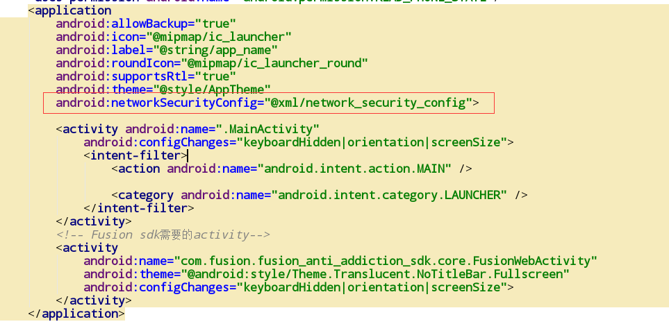
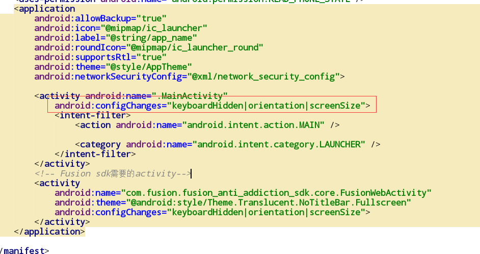

# fusionAAS手游实名认证和防沉迷系统的Android SDK对接Demo

### 关联项目

> 本Demo是[fusionAAS](https://gitee.com/fusionsdk/fusionaas)项目的Android客户端使用Demo

### Demo文件

- 下载 [安卓Demo APK例子](demo.apk)

### 1. 资源导入

#### 1.1 Android Studio资源导入

a) 拷贝`fusion_anti_addiction_sdk-release.aar`文件到lib目录。

b) 配置项目app的`build.gradle`文件

```gradle
android {
    //...
    repositories {
        flatDir {
            dirs 'libs'
        }
    }
}
dependencies {
    // ...（其他依赖）
    implementation (name: 'fusion_anti_addiction_sdk-release', ext: 'aar')
}
```

#### 1.2 Eclipse资源导入

拷贝libs和assets下的文件到项目对应文件夹中即可。

#### 1.3 资源特别说明

a) 当项目`targetVersion > 28`时候，将文件夹xml中对应的文件（`network_security_config.xml`）拷贝至项目res目录下的xml文件夹中（若没有xml文件夹则在项目res的目录下新建）

b) 在`AndroidManifest.xml`文件中的application标签下添加属性`android:networkSecurityConfig="@xml/network_security_config"`

如图：



### 2. 权限和Activity配置

#### 2.1 权限列表

```xml
<uses-permission android:name="android.permission.INTERNET"/>
<uses-permission android:name="android.permission.READ_EXTERNAL_STORAGE"/>
<uses-permission android:name="android.permission.WRITE_EXTERNAL_STORAGE"/>
<uses-permission android:name="android.permission.READ_PHONE_STATE"/>
```

如果项目本身已经添加过这些权限，则无需再重复添加。

#### 2.2 Activity添加

```xml
<!-- Fusion sdk需要的activity-->
<activity android:name="com.fusion.fusion_anti_addiction_sdk.core.FusionWebActivity" 
    android:theme="@android:style/Theme.Translucent.NoTitleBar.Fullscreen"
    android:configChanges="keyboardHidden|orientation|screenSize">
</activity>
```

注意，游戏的主Activity需要添加属性`android:configChanges="keyboardHidden|orientation|screenSize"`

如图：



#### 2.3 META添加


这里添加当前防成迷系统的自定义域名，请将我们提供的开源版的[fusionAAS](https://gitee.com/fusionsdk/fusionaas)部署到正式环境，并将系统的域名填入到META值中。

### 3. 方法调用

#### 3.1 初始化

```java
/**
 * 初始化方法，必须第一时间调用
 * @param appId 平台分配的应用id
 * @param context 当前上下文（Activity）
 */
public void initSdk(String appId, Activity context);
```

该方法默认使用系统控制弹出实名认证和实名认证页面为全屏。

或

```java
/**
 * 初始化方法，必须第一时间调用
 * @param appId 平台分配的应用id
 * @param context 当前上下文（Activity）
 * @param mode 实名制启动模式 
 * @param screen 实名制弹出样式
 */
public void initSdk(String appId, Activity context, int mode, String screen);
```

**mode**参数有两种：
- `FusionAntiMode.LanchType.MODE_DEFAULT` //由系统自己控制弹出实名制界面
- `FusionAntiMode.LanchType.MODE_CUSTOMER` //由游戏自己控制弹出时间，调用对应方法

**screen**参数有两种：
- `FusionAntiMode.ScreenType.SCREEN_DEFAULT` //全屏显示实名制窗口
- `FusionAntiMode.ScreenType.SCREEN_MINI` //选择mini窗口弹出

#### 3.2 注册监听

```java
FusionAntiSdk.getInstance().setRealNameListener(new IRealNameCallback() {
    @Override
    public void AllowLogin() {
        Log.e(TAG,"AllowLogin call");
        Toast.makeText(MainActivity.this,"允许登录",Toast.LENGTH_SHORT).show();
    }

    @Override
    public void ForbidLogin(String msg) {
        Log.e(TAG,"ForbidLogin call = "+msg);
        Toast.makeText(MainActivity.this,"不允许登录",Toast.LENGTH_SHORT).show();
    }

    @Override
    public void OffLine(String msg) {
        Log.e(TAG,"OffLine call = "+msg);
        Toast.makeText(MainActivity.this,"已经踢线",Toast.LENGTH_SHORT).show();
    }

    @Override
    public void AllowPay() {
        Log.e(TAG,"AllowPay call");
        Toast.makeText(MainActivity.this,"允许支付",Toast.LENGTH_SHORT).show();
    }

    @Override
    public void ForbidPay(String msg) {
        Log.e(TAG,"ForbidPay call = "+msg);
        Toast.makeText(MainActivity.this,"不允许支付",Toast.LENGTH_SHORT).show();
    }

    //以下方法只用CP主动调用实名制认证方法时候才有回调
    @Override
    public void BindSuccess() {
        Log.e(TAG,"BindSuccess call");
        Toast.makeText(MainActivity.this,"实名制绑定成功",Toast.LENGTH_SHORT).show();
    }

    @Override
    public void BindFail(String msg) {
        Log.e(TAG,"BindFail call = "+msg);
        Toast.makeText(MainActivity.this,"实名制绑定失败",Toast.LENGTH_SHORT).show();
    }
});
```

#### 3.3 获取当前用户的实名制信息

```java
FusionAntiSdk.getInstance().getRealNameState(uid);
```

- 参数1：账户的唯一标识
- 在游戏完成账号登录。准备进入游戏时候调用

#### 3.4 验证当前用户是否可以支付

```java
FusionAntiSdk.getInstance().checkMoneyLimit(uid, Float.valueOf(money));
```

- 参数1：账户唯一标识(和登录时候保持一致)
- 参数2：金额（元）
- 在用户点击任何支付下单前调用

#### 3.5 上报充值记录

```java
FusionAntiSdk.getInstance().sendCharge(uid, itemId, Float.valueOf(money));
```

- 参数1：账户唯一标识(和登录时候保持一致)
- 参数2：商品id
- 参数3：金额（元）
- 在用户完成支付，游戏客户端收到支付成功时候上报

#### 3.6 注销

```java
FusionAntiSdk.getInstance().logout();
```

- 注销当前用户，在游戏注销或者切换账号时候调用

#### 3.7 Activity方法重写

```java
FusionAntiSdk.getInstance().onActivityResult(requestCode, resultCode, data);
```

- 在游戏主Activity中重写即可
